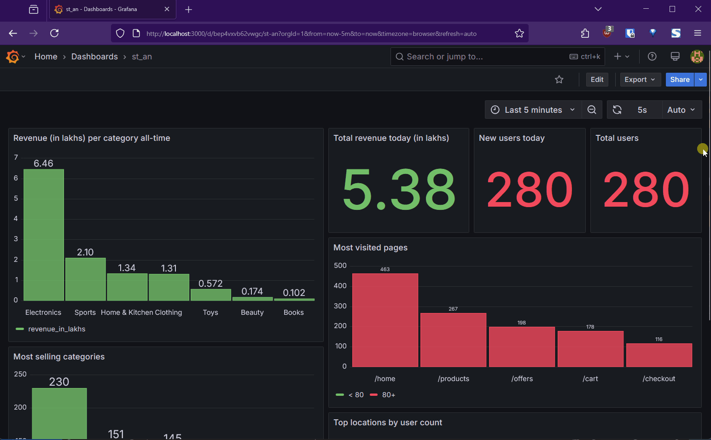

# E2E Streaming Data Pipeline

A fully Dockerized real-time data pipeline that simulates user behavior (clickstream and transactions), streams data via Kafka, processes it using Apache Spark, stores it in PostgreSQL / Minio, and visualizes insights using Grafana dashboard.

---

## Tech Stack

- **Python** + **Faker**
- **Kafka**
- **Apache Spark Structured Streaming**
- **PostgreSQL**
- **Minio**
- **Grafana**
- **Docker & Docker Compose**

---

### Data Generation & Kafka Topics

A Python producer script simulates and sends data to Kafka every few seconds across the following topics:

- `users` Contains user profile information
- `clickstream` Tracks user interactions such as page visits etc
- `transactions` Records purchase events

## Getting Started

### 1. Clone the repository

```bash
git clone https://github.com/kanak-b/thousand-wishes
cd thousand-wishes
```

### 2. Start the Project

```bash
docker-compose up --build
```

You will need to uncomment the build context lines for producer image in the docker-compose.yml file for this to run. Use --build for the first run it will create a producer image using the Dockerfile in the containers/producer folder

This will pull the docker images if not already in your system and create producer image as well start containers for all

> - Kafka broker
> - Python producer container
> - Spark master and worker containers
> - Minio
> - PostgreSQL
> - Grafana

Once producer container is created use

```bash
docker-compose up -d
```

to run in detached mode. Basically the control returns to terminal.


### 3. Submit the spark job

I have created a Makefile with most used commands

```bash
make submit-consumer_job
```

It submits the kafka consumer job which reads from the topics

```bash
docker exec spark-master spark-submit /opt/bitnami/spark/thousand-wishes/kafka-consumer.py
```

You should see some logs like this


---

## Grafana Dashboard

1. Open your browser and go to: [http://localhost:3000](http://localhost:3000)
2. Credentials as mentioned in docker-compose.yml:
   - **Username:** `user`
   - **Password:** `pass`
3. Navigate to the pre-configured dashboard

After submitting spark job data starts being pushed to postgres now you can preview the dashboard. It should look something like this.


I created the panels for grafana using sql queries which provide us with some basic data for visualization like -

- Total revenue (today)
- Revenue by product category
- Total users
- New users today
- Most visited pages
- Top user locations



---

## Directory Structure

```
📁 /
├── 📁 containers/
│   └── 📁 producer/
│       ├── Dockerfile
│       ├── producer.py
│       └── requirements.txt
├── 📁 grafana/
│   ├── 📁 dashboards
│   ├── 📁 provisioning/
│   │   ├── 📁 dashboards
│   │   └── 📁 datasources
├── 📁 initdb/
│   └── init.sql
├── 📁 jars
├── 📁 src/
│   ├── kafka-consumer.py
│   └── parquet-reader.py
├── Makefile
├── create-buckets.sh
└── docker-compose.yml

```

---

To stop and remove all containers:

```bash
docker-compose down
```

---

For a more detailed explanation of the code check out my [blog](https://kanak.blogpro.so/simulating-real-time-user-journeys-with-python-and-kafka)
